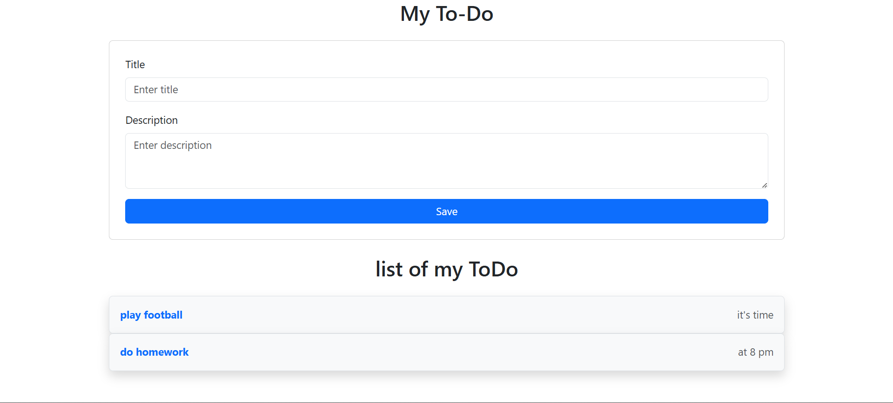

# React To-Do App

A simple and responsive To-Do application built with React and Bootstrap. This app allows users to add tasks with a title and description, displays the list of tasks, and can optionally mark them as done or pending.



## Table of Contents
- [Features](#features)
- [Prerequisites](#prerequisites)
- [Installation](#installation)
- [Usage](#usage)
- [Project Structure](#project-structure)
- [Screenshot](#screenshot)
- [Contributing](#contributing)
- [License](#license)

## Features
- **Add New Tasks**: Users can add a title (required) and a description (optional).
- **Display Task List**: All tasks are listed in a neat layout.
- **Responsive UI**: Uses Bootstrap for styling, ensuring a mobile-friendly design.

## Prerequisites
- **Node.js** (v14 or higher recommended)
- **npm** or **yarn** (latest version recommended)

## Installation
1. **Clone the repository** (or download the ZIP):
   ```sh
   git clone https://github.com/Ayat166/React_Day3.git
   ```
2. **Install dependencies:**
   ```sh
   npm install
   ```
3. **Start the development server:**
   ```sh
   npm start
   ```

## 📂 Project Structure
```
.
├── src
│   ├── assets
│   │   └── image.png         // Screenshot of the app
│   ├── combonents
│   │   ├── TodoForm.jsx      // Form component for adding new tasks
│   │   ├── TodoItem.jsx      // Individual task item component
│   │   └── TodoList.jsx      // Renders the list of tasks
│   └── App.jsx               // Main App component
├── package.json
└── README.md

```


## 🤝 Contributing
Feel free to fork this repo and submit a PR with improvements! 🚀

## 📜 License
This project is **MIT Licensed**.

---
Happy Coding! 🎉