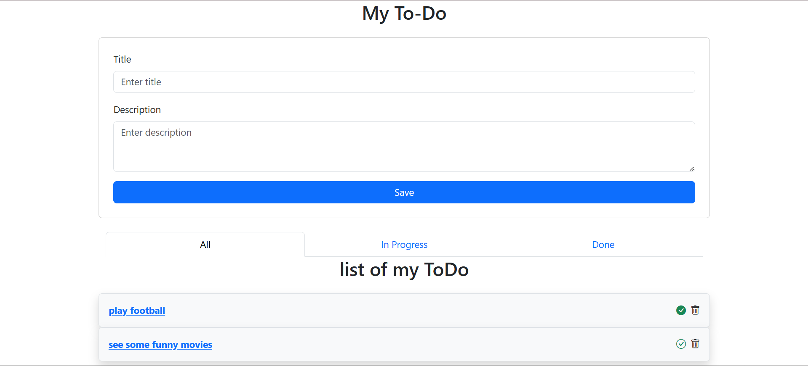
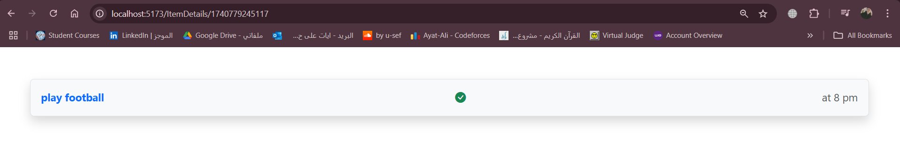

# React To-Do App

A simple and responsive To-Do application built with React and Bootstrap. This app allows users to add tasks with a title and description, displays the list of tasks, and can optionally mark them as done or pending. Users can also delete tasks and filter tasks based on their status. The app includes routing to view task details on a separate page.





## Table of Contents
- [Features](#features)
- [Prerequisites](#prerequisites)
- [Installation](#installation)
- [Usage](#usage)
- [Project Structure](#project-structure)
- [Screenshot](#screenshot)
- [Contributing](#contributing)
- [License](#license)

## Features
- **Add New Tasks**: Users can add a title (required) and a description (optional).
- **Display Task List**: All tasks are listed in a neat layout.
- **Mark as Done/Pending**: Users can update task status.
- **Delete Tasks**: Users can remove tasks from the list.
- **Filter Tasks**: Users can filter tasks based on their completion status.
- **View Task Details**: Users can click on a task to view more details on a separate page.
- **Responsive UI**: Uses Bootstrap for styling, ensuring a mobile-friendly design.

## Prerequisites
- **Node.js** (v14 or higher recommended)
- **npm** or **yarn** (latest version recommended)

## Installation

1. **Clone the repository** (or download the ZIP):
   ```sh
   git clone https://github.com/Ayat166/React_Day3.git
   ```
2. **Install dependencies:**
   ```sh
   npm install
   ```
3. **Start the development server:**
   ```sh
   npm start
   ```

## 📂 Project Structure
``` 
.
├── src
│   ├── assets
│   │   ├── image.png        // Screenshot of the app
│   │   ├── image2.png       // New Screenshot 1
│   │   └── image3.png       // New Screenshot 2
│   ├── components
│   │   ├── FilterationList.jsx  // Component for filtering tasks
│   │   ├── TodoForm.jsx         // Form component for adding new tasks
│   │   ├── TodoItem.jsx         // Individual task item component
│   │   └── TodoList.jsx         // Renders the list of tasks
│   ├── pages
│   │   ├── Index.jsx            // Main index page
│   │   └── ItemDetails.jsx      // Page for viewing task details
│   ├── App.css                  // Stylesheet
│   ├── App.jsx                  // Main App component
└── package.json
```

## 🤝 Contributing
Feel free to fork this repo and submit a PR with improvements! 🚀

## 📜 License
This project is **MIT Licensed**.

---
Happy Coding! 🎉